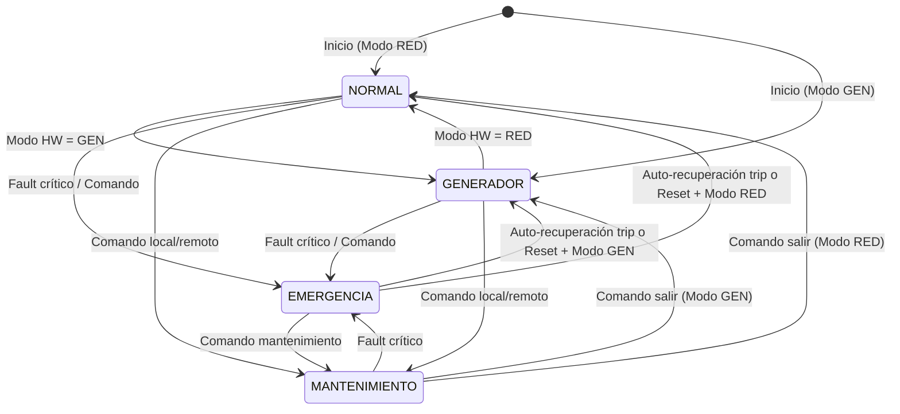

# Máquina de Estados - Supervisor de Bombas

## Diagrama de Estados



## Tabla de Estados

| Estado | Bombas Permitidas | Relés | LEDs | Descripción |
| --- | --- | --- | --- | --- |
| **NORMAL** | 3 (B1, B2, B3) | Passthrough PLC | 🟢 OK | Modo RED - Funcionamiento normal |
| **GENERADOR** | 1 (solo B1) | B1=PLC, B2/B3=Abiertos | 🟡 GEN | Generador activo - Solo bomba prioritaria |
| **EMERGENCIA** | 0 | Todos abiertos | 🔴 FAULT (parpadeo) | Fallo crítico - Bloqueo total |
| **MANTENIMIENTO** | 0 | Todos abiertos | 🔵 OK (parpadeo lento) | Modo local - Bloqueo intencional |

## Transiciones Detalladas

### NORMAL → GENERADOR

- **Trigger**: Pin PC0 = LOW (contacto seco inversor abierto)
- **Debounce**: 5 lecturas consistentes @ 100Hz (50ms)
- **Acción**: Bloquear relés B2, B3 inmediatamente
- **Notificación**: Evento `MODO_CHANGE` + `STATE_CHANGE`

### GENERADOR → NORMAL

- **Trigger**: Pin PC0 = HIGH (contacto seco inversor cerrado)
- **Debounce**: 50ms
- **Acción**: Restaurar passthrough B2, B3
- **Notificación**: Evento `MODO_CHANGE` + `STATE_CHANGE`

### CUALQUIER → EMERGENCIA

**Triggers automáticos:**

- Feedback timeout (2s): PLC ordena pero no hay retorno aux
- Contactor pegado: Feedback activo sin orden PLC
- Sensor nivel fuera de rango (3.5-21mA)
- Watchdog MCU
- Comunicación MCU-Linux perdida \> 10s

**Triggers manuales:**

- Comando `TRIGGER_EMERGENCIA` desde Linux/dashboard
- Botón físico emergencia (futuro)

**Acción inmediata:**

- Abrir TODOS los relés (B1, B2, B3)
- Parpadear LED FAULT (200ms)
- Enviar evento `ERROR` con código

### CUALQUIER → MANTENIMIENTO

- **Trigger**: Comando `SET_MANTENIMIENTO(activo=true)`
- **Acción**: Abrir todos los relés
- **LED OK**: Parpadeo lento (1s)
- **Salida**: Comando `SET_MANTENIMIENTO(activo=false)` → vuelve a
  NORMAL/GENERADOR según HW

### EMERGENCIA → NORMAL/GENERADOR

Dos caminos de salida, con consecuencias distintas:

#### 1. Auto-recuperación (SIF-04, política Fase 5)

- **Trigger**: `TripPolicy` decide `RECOVER` — sobrecarga previa, corriente
  ya limpia, enfriamiento de 60 s cumplido, quedan intentos
- **Acción**: sale de EMERGENCIA, re-arma el protector
- **NO** limpia los `fault_count` de las bombas: una bomba sin feedback
  sigue bloqueada. Lo implementa `StateMachine::autoRecoverTrip()`, que solo
  acepta únicamente una emergencia con código `ERR_SOBRECARGA`
- **Límite**: 3 intentos en 15 min; al agotarlos queda latcheada (C-02)

#### 2. Reset de operador

- **Trigger**: Comando `RESET_EMERGENCIA` (código 0xFFFF)
- **Condición**: No haber triggers activos
- **Acción**: Reset de contadores fault, transición a estado según modo
  HW, **y puesta a cero de los intentos** de la política de trip
  (`TripPolicy::operatorReset()`)

## Lógica de Control de Relés (Por Estado)

```text
┌─────────────────────────────────────────────────────────────┐
│                    FUNCIÓN PUEDE_ARRANCAR(bomba_id)         │
├─────────────────────────────────────────────────────────────┤
│  if estado == EMERGENCIA or MANTENIMIENTO: return FALSE    │
│  if estado == GENERADOR and bomba_id != 0: return FALSE    │
│  if bomba[fault_count] > 0: return FALSE                   │
│  return TRUE                                                │
└─────────────────────────────────────────────────────────────┘

┌─────────────────────────────────────────────────────────────┐
│                    ACTUALIZACIÓN RELÉS                       │
├─────────────────────────────────────────────────────────────┤
│  for cada bomba i:                                          │
│    if puedeArrancar(i):                                     │
│       relé[i] = plc_order[i]   // Passthrough condicionado  │
│    else:                                                    │
│       relé[i] = FALSE           // Seguridad: abierto       │
│                                                              │
│  Anti-cruzamiento: min 100ms entre conmutaciones            │
└─────────────────────────────────────────────────────────────┘
```

## Prioridades de Seguridad

```text
PRIORIDAD 1 (Máxima): EMERGENCIA forzada
    └─ Bloquea todo, ignora modo HW y mantenimiento

PRIORIDAD 2: MANTENIMIENTO
    └─ Bloquea todo, permite salir solo por comando explícito

PRIORIDAD 3: MODO HARDWARE (RED/GENERADOR)
    └─ RED: 3 bombas
    └─ GEN: 1 bomba (B1)

PRIORIDAD 4: FAULT INDIVIDUAL POR BOMBA
    └─ Si bomba tiene fault_count > 0 → esa bomba bloqueada
    └─ Otras bombas siguen operando según modo
```

## Eventos Generados (MCU → Linux)

| Evento | Código | Payload | Descripción |
| --- | --- | --- | --- |
| STATE_CHANGE | 0x10 | (ant<<8)\|nuevo | Cambio de estado principal |
| BOMBA_START | 0x20 | - | Feedback confirma arranque |
| BOMBA_STOP | 0x21 | - | Feedback confirma parada |
| BOMBA_FAULT | 0x22 | - | Timeout feedback / mismatch |
| FEEDBACK_MISMATCH | 0x23 | - | PLC ≠ Feedback |
| NIVEL_UPDATE | 0x30 | % nivel | Actualización nivel agua |
| MODO_CHANGE | 0x40 | 0/1 | Cambio RED/GEN detectado |
| HEARTBEAT | 0x50 | (estado<<8)\|nivel | Latido periódico (1s) |
| ERROR | 0xFF | código | Error crítico |

## Comandos Recibidos (Linux → MCU)

| Comando | Código | Parámetros | Descripción |
| --- | --- | --- | --- |
| SET_MODO_GENERADOR | 0x40 (MODO_CHANGE) | bit 0: 1=GEN, 0=RED | Forzar modo (override HW) |
| SET_MANTENIMIENTO | 0x10 (STATE_CHANGE) | payload = (0<<8)\|3 (MANTENIMIENTO) | Activar/desactivar mantenimiento |
| TRIGGER_EMERGENCIA | 0x10 (STATE_CHANGE) | payload = (codigo<<8)\|2 (EMERGENCIA) | Forzar emergencia |
| RESET_EMERGENCIA | 0xFF (ERROR) | payload = 0xFFFF | Reset emergencia + latch fallos |
| REQUEST_STATUS | 0x10 | - | Solicitar estado completo |

## Tiempos Críticos

| Parámetro | Valor | Configurable |
| --- | --- | --- |
| Loop principal | 10ms (100Hz) | No |
| Debounce entradas digitales | 50ms | `DEBOUNCE_MS` |
| Feedback timeout | 2000ms | `FEEDBACK_TIMEOUT_MS` |
| Heartbeat MCU→Linux | 1000ms | `HEARTBEAT_MS` |
| Watchdog interno | 5000ms | `WATCHDOG_TIMEOUT_MS` |
| Anti-cruzamiento relés | 100ms | `MIN_SWITCH_INTERVAL_MS` |
| Debounce modo HW | 50ms | 5 ciclos @ 100Hz |
| Debounce feedback | 20ms | 2 ciclos @ 100Hz |

## Códigos de Error (Emergencia)

Estos son los códigos **reales**, los que emite `mcu/include/config.h` y
mapea `MCU_ERROR_MESSAGES` en `linux/app/state.py`. La tabla anterior de
este documento (0x0001..0x8000) no coincidía con **ninguno** de ellos.

| Código | Descripción | Nivel de alerta |
| --- | --- | --- |
| 0x6001 | Trip por sobrecarga del generador | warning |
| 0x6002 | Corriente con relés abiertos: contactor pegado | critical |
| 0x6003 | Sensor de corriente (CT) fuera de rango | critical |
| 0x6004 | SIF-05: sensor de nivel fuera de rango (3.5-21 mA) | critical |
| 0x6010 | Aviso: corriente cerca del límite | warning |
| 0x6020 | Trip re-armado automáticamente | info |
| 0x6021 | Trip: intentos agotados, **exige operador** | critical |

Además:

| Valor | Descripción |
| --- | --- |
| `0xFF` + payload `0xFFFF` | Comando de reset de emergencia desde Linux |
| `0xFF` + payload `0xFF00` | `trigger_emergencia` con código por defecto |
| `0x22` (`BOMBA_FAULT`) | Fault de feedback de una bomba concreta, con su `bomba_id` |

> El fault de feedback **no tiene código 0x6xxx propio**: viaja como evento
> `BOMBA_FAULT` (0x22) y bloquea esa bomba. Solo SIF-03 (contactor soldado)
> escala a emergencia global, con `ERR_CONTACTOR_PEGADO` (0x6002).

| Código retirado | Por qué |
| --- | --- |
| 0x0001-0x0003, 0x0010-0x0030 | El fault de bomba viaja como evento con `bomba_id`, no como código por bomba |
| 0x0100, 0x0200 | El sensor de nivel usa 0x6004 |
| 0x0400 | El watchdog no emite código: reinicia el MCU (IWDG) y el PNOZ abre los relés |
| 0x0800 | La pérdida de comunicación la detecta **Linux**, no el MCU: `AlertManager.check_silence()`, alerta `source="MCU"` con `codigo=0x50` |
| 0x1000, 0x8000 | No existen |
